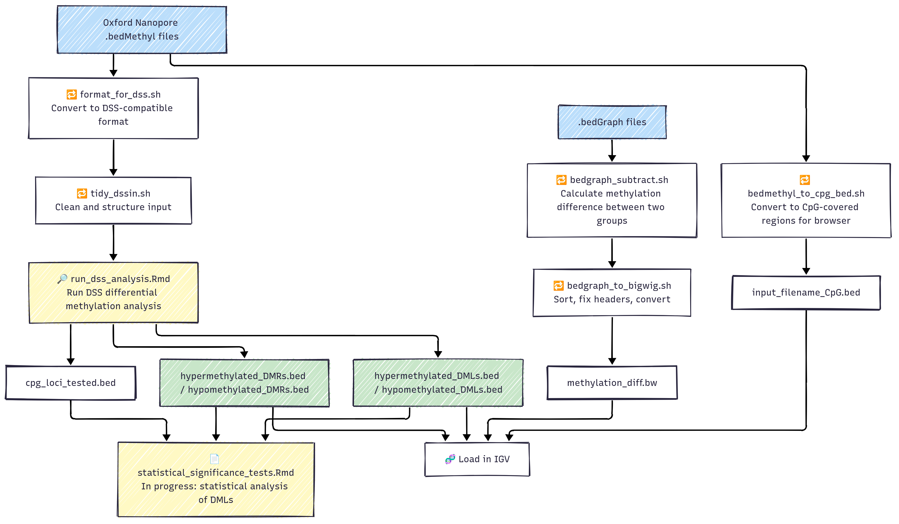

# Oxford Nanopore Methylation Data Analysis – DSS Pipeline


## Description

This project is part of my MSc Bioinformatics project in undertanding DNA methylation patterns in mammalian cells using OXford Nanopore sequensing data. It explores whether methylation patterns differ significantly between wild-type and mutant mammalian cells lacking key DNA methyltransferases. The pipeline is built around the DSS package in R to:

- Detect differentially methylated loci (DMLs) and regions (DMRs)
- Filter for canonical chromosomes
- Evaluate biological relevance and statistical significance of findings

The motivation behind this work is to better understand how gene body methylation may influence gene expression. Long read sequencing offers a promising way to observe these patterns at high resolution across the entire genome. Through this project so far, I gained experience working with large methylation datasets, developing shell workflows, and performing statistical analyses using R.

Note: This project is still in progress.

## Table of Contents

- [Installation](#installation)
- [Usage](#usage)
- [Credits](#credits)
- [License](#license)

## Installation

Clone the repository:
```
git clone https://github.com/cemileblks/dss-analysis.git
cd dss-analysis
```
Install required software:
- R (v4.0+)
- R packages: `DSS`, `bsseq`, `GenomicRanges`, `rtracklayer`
- Command-line tools: `bedtools`, `awk`, `bash`
- IGV or UCSC Genome Browser (for visualisations)

## Usage

This pipeline processes `.bedMethyl` and `.bedGraph` files generated from Oxford Nanopore methylation data. It performs differential methylation analysis using the DSS R package and produces `.bed` and `.bw` files for downstream visualisation and analysis.

The outputs include:
- Lists of differentially methylated loci (DMLs) and regions (DMRs)
- Filtered and converted `.bed` files for genome browser tracks
- A `.bigWig` file showing methylation differences between conditions
- (In progress) A statistical summary of significant DMLs/DMRs in `.Rmd` format

### 📊 Workflow Diagram



## Credits

- [DSS R package documentation](https://bioconductor.org/packages/release/bioc/vignettes/DSS/inst/doc/DSS.html)  
  Used for differential methylation analysis in R.

- [CLASS 2023 tutorials](https://github.com/boulderrinnlab/CLASS_2023)  
  Helpful for understanding genomic overlaps and using `GenomicRanges`.

Special thanks to my MSc supervisor and lab group for their guidance through this project.

## License

This project is shared for academic and educational purposes only and does not currently use a formal open-source license. If you plan to reuse or modify the code, please cite the project appropriately.